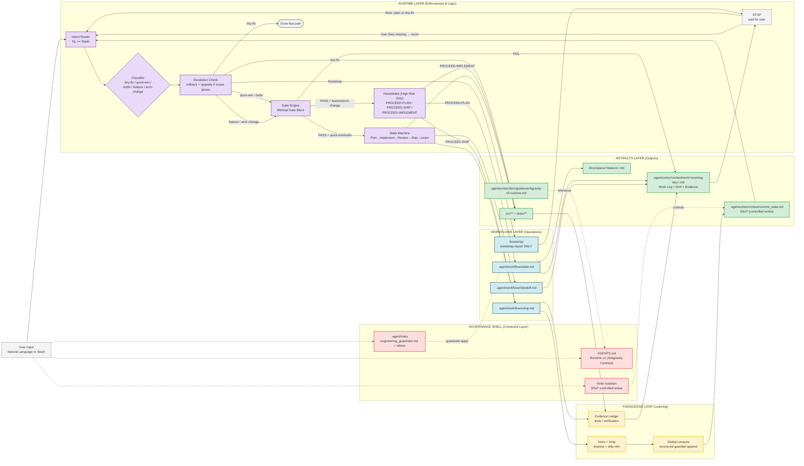

# Agentic OS Runtime — Anti-Drift Engine

## Antigravity Hard-Path Enforcement Overlay

Engine generation: v5 (anti-drift overlay) · Canonical contract: AGENTS.md §Agentic OS Runtime v1
Date: 2026-04-17

> **Two version axes — do not conflate.** "Runtime v5" throughout this file is this
> anti-drift *engine spec's* own generation number; the canonical Antigravity runtime
> **contract** version is **Runtime v1** (see `AGENTS.md §Agentic OS Runtime v1`). The
> framework release version (v1.8.6) is tracked separately in `CHANGELOG.md`.
Scope: **Antigravity environments** (token-generation agents where shell exit codes don’t halt execution)

### Why v5 exists

Agentic OS already enforces strong process gates via workflows:

* `/bootstrap` reads SSoT + Work Log, locks classification, and only allows upward changes via rollback + re-entry
* `/plan` is “NO CODING YET” and requires spec for feature/architecture-change
* `/implement` has a hard gate `state >= IMPLEMENTABLE` and scope escalation checks
* `/ship` requires state TESTED and handoff for non-tiny-fix, then updates SSoT via guarded writes. `/retro` is the only non-ship SSoT write exception, and only for structured Global Lessons.
* AGENTS.md is injected every turn and already defines write isolation + evidence requirements
* Handoff timing follows the cross-platform SSoT `AGENTS.md §Context Pruning` (context occupancy + phase boundary, NOT turn-count); per-platform caching/compaction detail in `.agentcortex/docs/guides/token-governance.md §6.1`. Antigravity/Gemini's large window (1M–2M) + implicit caching means fewer handoffs — reason in occupancy %, not absolute turns.

**Remaining issue:** Antigravity sometimes “continues anyway” even when a workflow says STOP (because STOP is still text).
Runtime v5 adds **hard generation-path checkpoints** that are short, deterministic, and token-cheap.

---

## Architecture Diagram



---

## 1) Runtime v5 Contract (Minimal, Always-On)

### 1.1 NL == Slash intent equivalence

Natural language must map to canonical workflows **before any output**.
This is consistent with AGENTS.md being loaded every turn.

**Trigger examples:**

| Trigger example                             | Route      |
| ------------------------------------------- | ---------- |
| “help me design”, “幫我規劃”, “plan this”       | `/plan`    |
| “ship this”, “完成了”, “finalize”              | `/ship`    |
| “typo”, “rename variable”, “comment change” | `tiny-fix` |

If unclear: default to `/plan` and record “NL fallback” in Work Log Drift Log.

---

## 2) Minimal Gate Block (Antigravity proof)

Before **any** `/plan` or `/ship` execution (non-tiny-fix), the agent MUST output the following YAML **and nothing else**:

```yaml
gate: plan|ship
classification: tiny-fix|quick-win|hotfix|feature|architecture-change
branch: <git_branch_or_worklog_name>
checks:
  worklog_exists: yes|no
  spec_exists: yes|no|na
  state_ok: yes|no
  handoff_ok: yes|no|na
verdict: pass|fail
missing: []
```

### 2.1 Detection rules

* **Branch**: use git branch if available; else infer from `.agentcortex/context/work/<worklog-key>.md` naming convention.
* **Work Log resolution**: normalize the branch into a filesystem-safe `<worklog-key>` before checking `worklog_exists`. If the active log is recoverable, create or recover it before returning `verdict: fail`.
* **Spec**: for `feature` / `architecture-change`, spec must exist per `/plan` “Spec Gate” behavior.
* **State**:
  * `/implement` hard gate requires `state >= IMPLEMENTABLE`
  * `/ship` requires state `TESTED`
* **Handoff**: for non-tiny-fix, `/ship` requires `/handoff` completed.

### 2.2 Fail behavior (Instructional Rejection)

If `verdict: fail`:

* output **only** the gate block (with `missing` populated)
* STOP (no plan, no code, no doc edits)

This keeps the agent inside a deterministic “verify first” path.

---

## 3) Two-Turn Handshake (High-risk only)

Your workflows already separate phases (plan vs implement), but Antigravity can still “overrun” in a single response.
Runtime v5 adds a **user-controlled continuation token**.

Handshake applies only to:

* `feature`
* `architecture-change`

### 3.1 Plan handshake

After a passing gate for `/plan` high-risk tasks:

> Gate passed. Reply **PROCEED-PLAN** to continue.

Then STOP.

**When user replies `PROCEED-PLAN`:**

* produce **plan only** (no code), consistent with `/plan` “NO CODING YET”.

### 3.2 Implement handshake (prevents Plan→Implement drift)

After plan is approved and Work Log contains a plan section:

> Gate passed. Reply **PROCEED-IMPLEMENT** to continue.

Requirement:

* Must cite Work Log plan section (path + heading) before writing code.

### 3.3 Ship handshake

After a passing gate for `/ship` high-risk tasks:

> Gate passed. Reply **PROCEED-SHIP** to continue.

Then STOP.

---

## 4) /bootstrap Hard Stop (Antigravity specific)

* `/bootstrap` outputs **bootstrap-report only**, then STOP.
* Next step must be `/plan` (or tiny-fix).
* **No code output** is allowed immediately after bootstrap.

---

## 5) Docs-first requirement (front-load documentation)

For `feature` / `architecture-change`, plan output MUST include:

```text
Docs:
- <at least one path in docs/specs/ or .agentcortex/context/>
```

---

## 6) Scope rule (reduce classification ambiguity)

To avoid the model “choosing tiny-fix because it’s easiest,” add this deterministic boundary:

* `< 3 files` and **no semantic change** → `tiny-fix` (canonical threshold — see `AGENTS.md §Agentic OS Runtime v1` rule 2 / `engineering_guardrails.md §10.1, §10.3`)
* **bug fix** isolated to one area/module → `hotfix`
* **new behavior** / cross-file / new module → `feature`

If “tiny-fix” touches logic or multiple files, escalate to `hotfix`.

---

## 7) Evidence discipline remains canonical

Agentic OS already enforces “NO EVIDENCE = NO COMPLETION” at the AGENTS.md level and in shipping.
Runtime v5 clarifies the minimum:

* At least **one** test command OR verification output must be recorded (Work Log Evidence section).
* If evidence is empty, `/ship` must be rejected.

---

## 8) Sentinel Check (Injection Diagnostic)

**Canonical sentinel: `⚡ ACX`** (defined in `AGENTS.md §Agentic OS Runtime v1` rule 11).

Every response MUST end with `⚡ ACX`. If this marker is missing, the prompt injection is broken or truncated. `validate.sh`/`validate.ps1` accept the emoji form `⚡ ACX` or the plain `ACX` tag when auditing Work Log Phase Summaries.

---

## 9) Definition of Done for Runtime v5

In Antigravity, for any high-risk task:

1. Gate YAML printed first
2. PASS → waits for PROCEED token
3. PROCEED-PLAN → plan only (no code)
4. PROCEED-IMPLEMENT → code changes (scoped)
5. evidence recorded
6. PROCEED-SHIP → ship package + SSoT update

If any required artifact is missing, output MUST be limited to:

* gate block + missing list

---

## End of Runtime v5 Spec
